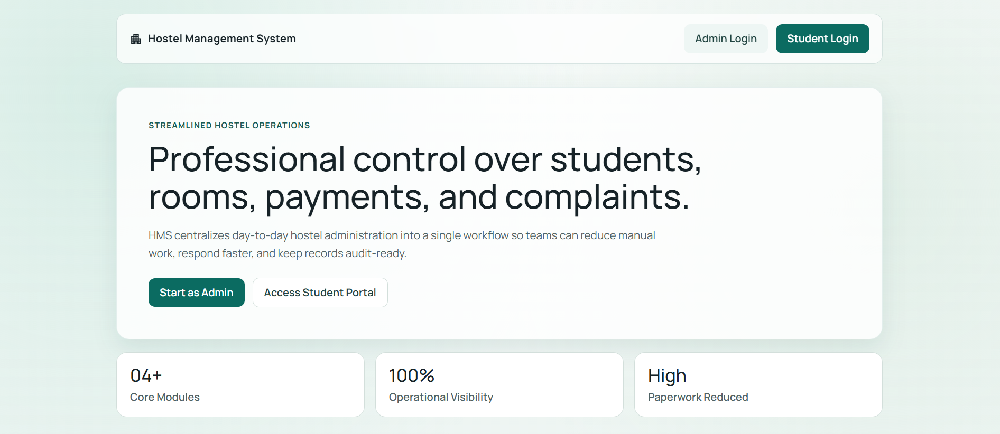
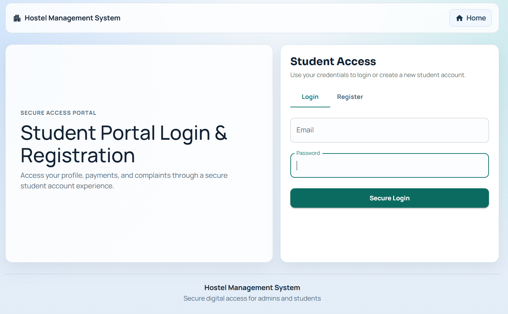
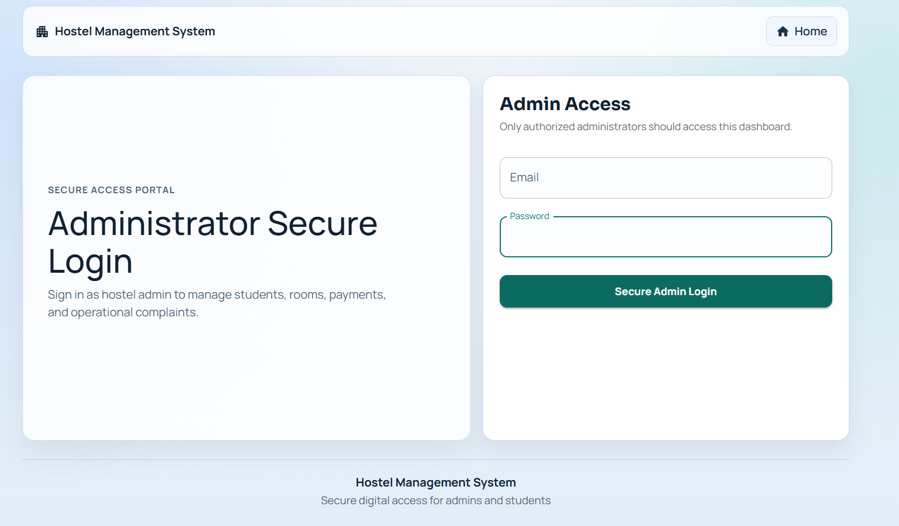
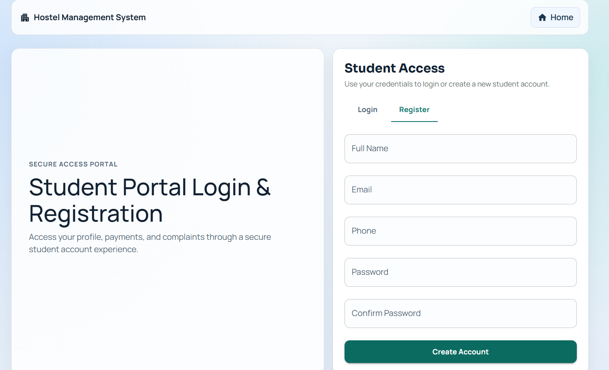
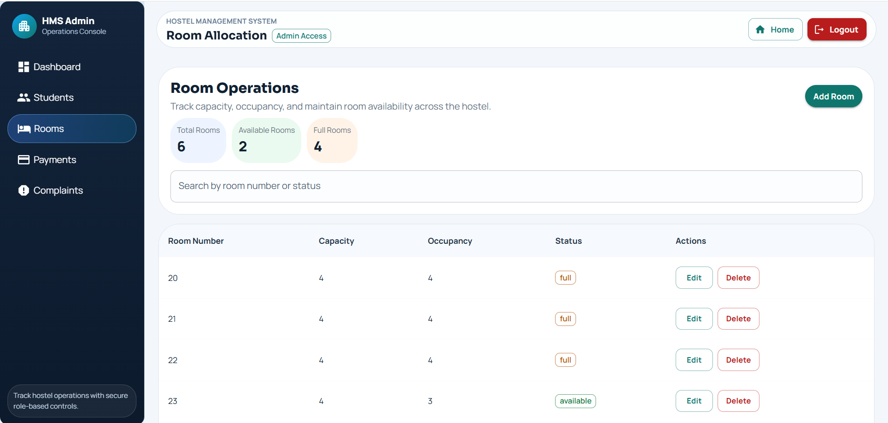

# 🏠 Hostel Management System (MERN Stack)
# 🏠 Hostel Management System (MERN Stack)


## 📌 Project Overview

The Hostel Management System is a full-stack web application developed using the MERN Stack (MongoDB, Express.js, React.js, and Node.js). It simplifies hostel management by providing separate dashboards for administrators and students. The application supports secure authentication, room allocation, online fee payment, and efficient management of hostel operations.

---

## ✨ Features

### Admin Module
- Admin Login
- Dashboard
- Student Management
- Room Allocation
- Fee Management
- Payment Verification
- View Reports

### Student Module
- Student Registration & Login
- Profile Management
- Room Details
- Online Fee Payment
- Payment History

### Security
- JWT Authentication
- Password Encryption using bcryptjs
- Role-Based Access Control (RBAC)
- Protected Routes

---

## 🛠️ Technology Stack

### Frontend
- React.js
- Bootstrap
- Material UI
- Axios

### Backend
- Node.js
- Express.js

### Database
- MongoDB
- Mongoose

### Authentication
- JWT
- bcryptjs

### Payment Gateway
- Razorpay

### Tools
- Git
- GitHub
- Postman

---

## 📂 Project Structure

```
HMS-Mern
│
├── client/
│   ├── src/
│   ├── public/
│
├── server/
│   ├── controllers/
│   ├── routes/
│   ├── models/
│   ├── middleware/
│   ├── config/
│
└── README.md
```

---

## 🚀 Installation

### Clone Repository

```bash
git clone https://github.com/ilayaraja20/HMS-Mern.git
```

### Backend

```bash
cd server
npm install
npm start
```

### Frontend

```bash
cd client
npm install
npm start
```

---

## ⚙️ Environment Variables

Create a `.env` file inside the server folder.

```
PORT=
MONGODB_URI=
JWT_SECRET=
RAZORPAY_KEY_ID=
RAZORPAY_SECRET=
```

---

## 📷 Screenshots

### Home Page


### Login Page


### Admin Login


### Registration Page


### Admin Dashboard


### Student Dashboard


### Room Allocation


## 📖 API Features

- User Authentication
- Student Management
- Room Allocation
- Payment APIs
- Dashboard APIs

---

## 🔮 Future Enhancements

- Email Notifications
- Attendance Module
- Complaint Management
- Mobile Responsive UI
- Hostel Analytics Dashboard

---

## 👨‍💻 Author

**Ilayaraja J**

- LinkedIn: https://www.linkedin.com/in/ilayarajajothi
- GitHub: https://github.com/ilayaraja20

---

## ⭐ Support

If you like this project, please give it a ⭐ on GitHub.
